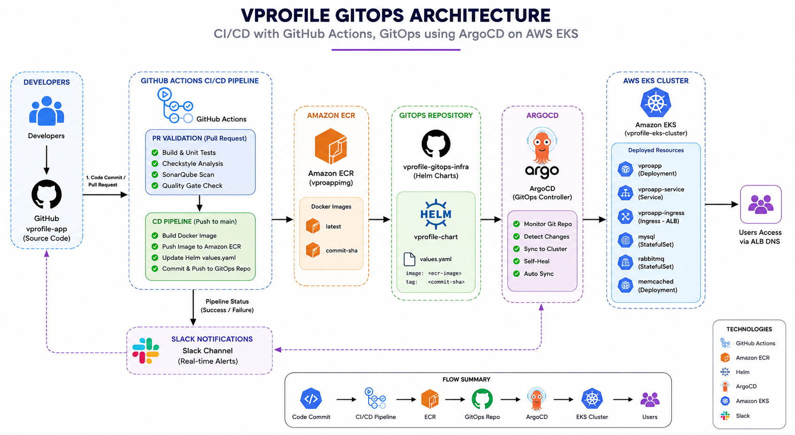
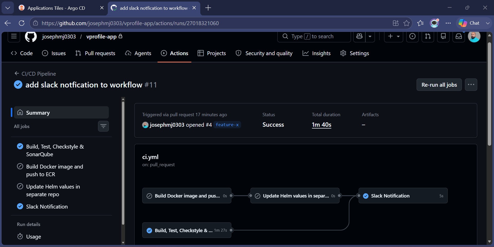
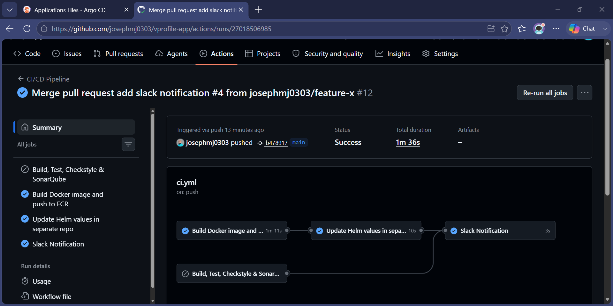
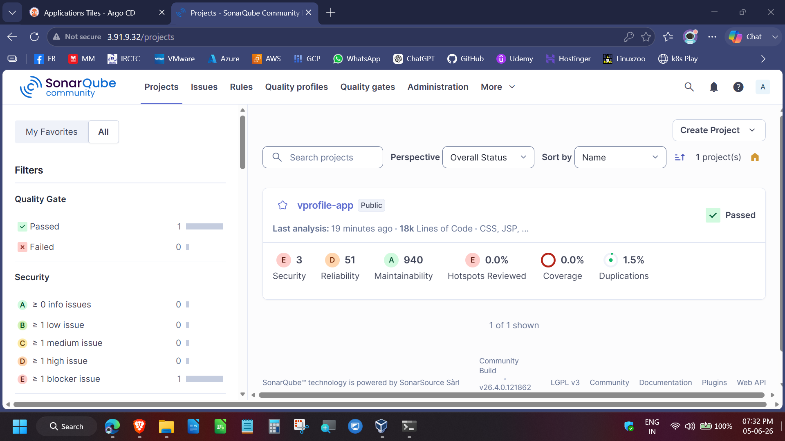
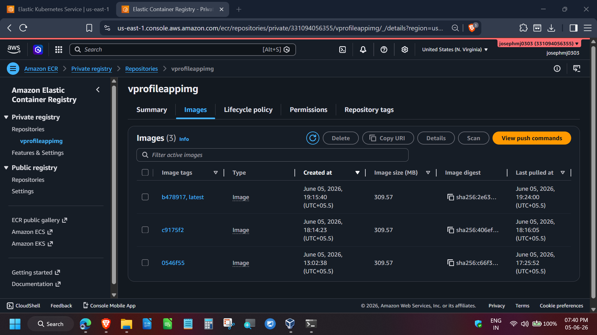
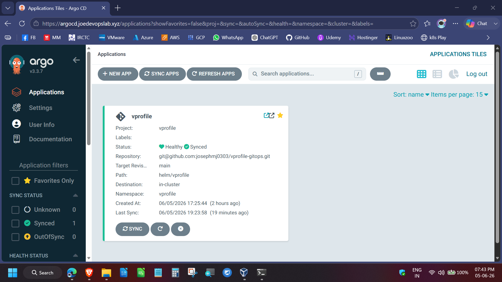
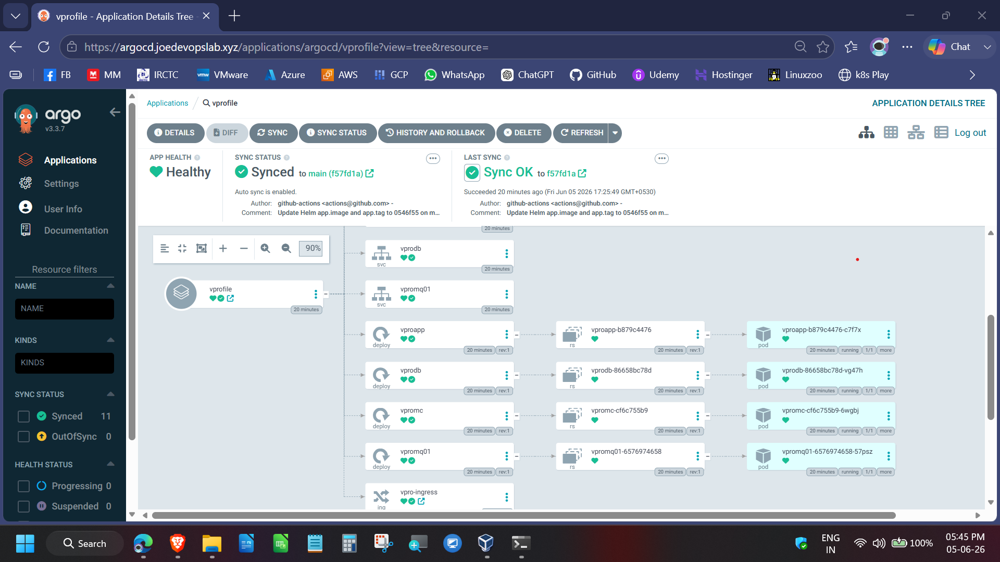
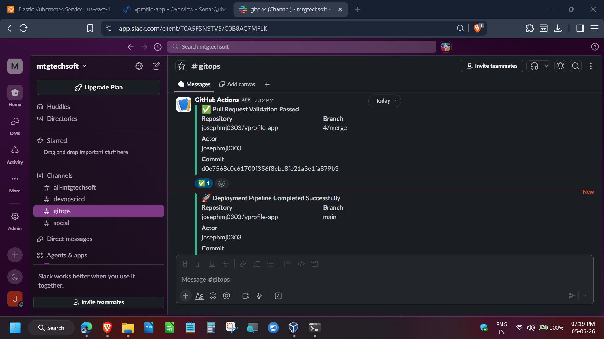
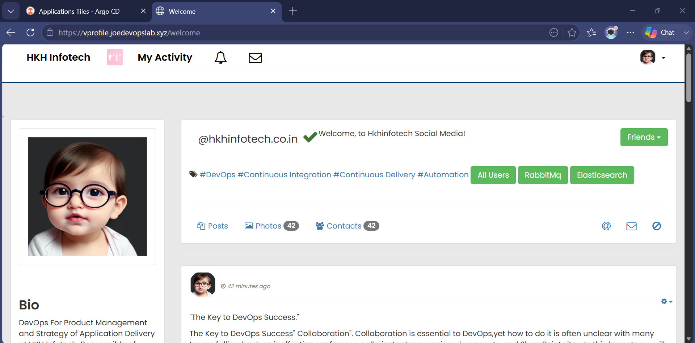

# VProfile GitOps EKS Platform

Production-grade GitOps implementation of the VProfile application on AWS EKS using Terraform, ArgoCD, GitHub Actions, Helm, Amazon ECR, SonarQube, and Slack Notifications.

---

## 🚀 Architecture



---

## 📌 Project Overview

This project demonstrates an end-to-end GitOps workflow for deploying a Java-based application on AWS EKS.

The platform follows GitOps principles where application changes are automatically deployed through ArgoCD after successful CI/CD validation and container image publication.

### Key Features

* Infrastructure provisioning using Terraform
* AWS EKS managed Kubernetes cluster
* GitHub Actions based CI/CD pipelines
* SonarQube quality gate validation
* Docker image build and publishing to Amazon ECR
* Helm-based Kubernetes deployments
* ArgoCD Auto Sync and Self-Healing
* AWS Load Balancer Controller (ALB Ingress)
* IRSA (IAM Roles for Service Accounts)
* Slack deployment notifications

---

## 📂 Repository Structure

This project is split into three repositories:

| Repository            | Purpose                                       |
| --------------------- | --------------------------------------------- |
| vprofile-app          | Application source code and CI/CD pipelines   |
| vprofile-gitops       | Helm charts and ArgoCD deployment manifests   |
| vprofile-gitops-infra | Terraform infrastructure and EKS provisioning |
```
vprofile-app/
├── .github
│   └── workflows
│       └── ci.yml
├── Docker-files
│   ├── app
│   │   ├── Dockerfile
│   │   └── multistage
│   ├── db
│   │   ├── Dockerfile
│   │   └── db_backup.sql
│   └── web
│       ├── Dockerfile
│       └── nginvproapp.conf
├── README.md
├── pom.xml
├── sonar-project.properties
├── sonar-setup.sh
├── src               # Application Source Code (Private)
└── docs
    └── images
        ├── architecture-diagram.png
        ├── pr-validation-pipeline.png
        ├── deployment-pipeline.png
        ├── sonarqube-dashboard.png
        ├── ecr-repo.png
        ├── argocd-application.png
        ├── argocd-resource-tree.png
        ├── eks-cluster.png
        ├── slack-notification.png
        └── vprofile-application.png


```

### Related Repositories

* https://github.com/josephmj0303/vprofile-gitops
* https://github.com/josephmj0303/vprofile-gitops-infra

---

## 🔄 CI/CD & GitOps Workflow

1. Developer pushes code to GitHub.
2. Pull Request triggers:

   * Maven Build
   * Unit Tests
   * Checkstyle
   * SonarQube Analysis
   * Quality Gate Validation
3. Merge to main branch triggers:

   * Docker Image Build
   * Push Image to Amazon ECR
   * Update Helm values.yaml
   * Commit changes to GitOps repository
4. ArgoCD detects Git changes.
5. ArgoCD synchronizes workloads to AWS EKS.
6. Slack notifications report pipeline status.

---

## 📸 Screenshots

### Pull Request Validation



### Deployment Pipeline



### SonarQube Quality Gate



### Amazon ECR Repository



### ArgoCD Application



### ArgoCD Resource Tree



### AWS EKS Cluster


### Slack Notifications



### Running Application



---

## ⚙️ Technology Stack

* AWS EKS
* Terraform
* GitHub Actions
* ArgoCD
* Helm
* Docker
* Amazon ECR
* SonarQube
* Slack
* Maven
* Java

---

## 🧠 Results

* Fully automated GitOps deployment workflow
* Zero manual Kubernetes deployments
* Automated image versioning and releases
* Continuous quality validation through SonarQube
* Centralized deployment visibility via Slack
* Self-healing Kubernetes deployments through ArgoCD

---

## 📈 Future Enhancements

* Prometheus Monitoring
* Grafana Dashboards
* ArgoCD Notifications
* Trivy Container Scanning
* External Secrets Operator
* Multi-Environment Deployments (Dev / Stage / Prod)

---

🔒 Source Code Notice
This repository intentionally excludes application source code.

To simulate real-world enterprise practices
To protect application-level intellectual property
To focus this project on DevOps engineering capabilities

---

## 👨‍💻 Author

**Joseph MJ**

DevOps Porfolio Project

DevOps Engineer | AWS | Kubernetes | Terraform | GitOps | CI/CD

